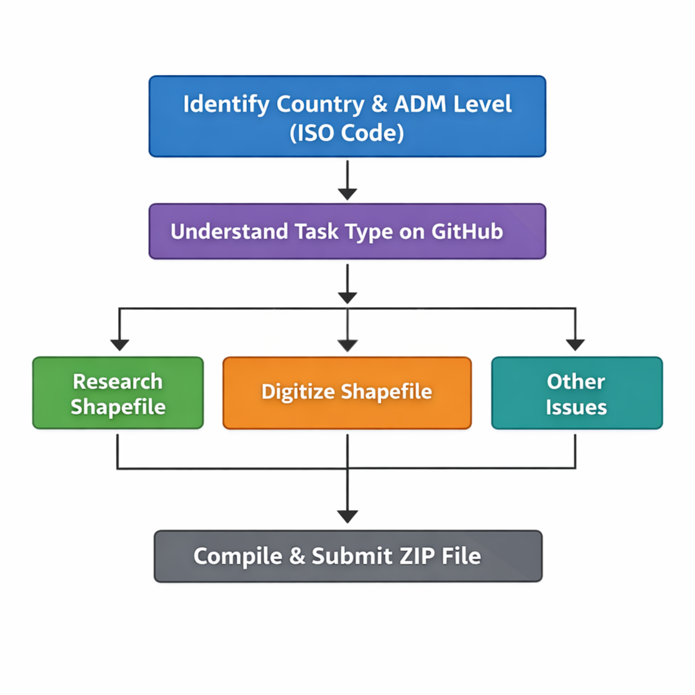

# End-to-End Pipeline for geoBoundaries

## Using GitHub

Tasks are located on GitHub and are called **“[issues](https://github.com/wmgeolab/geoBoundaries/issues)”**.

## Overview of Issue Workflow

1. Identify the country and administrative division (ADM level) using [ISO codes](#identifying-the-country).
2. Understand the [task type](#understand-the-task-type) on GitHub.
3. Follow the corresponding detailed guide:
   - **[Research a shapefile](#researching-boundaries)**
   - **[Digitize a shapefile](#digitizing)**
   - **[Other issues](#other-common-issues)**
4. Compile the completed files into a zip file and submitting
---

## Identifying the country
### Finding ISO Codes

An ISO Code is a standardized, unique, short identifier for countries that is established by the International Organization for Standardization.

The **issue title** indicates the country and administrative division level. 

Example: `VNM_ADM2` → `VNM` = Vietnam, `ADM2` = administrative division level 2.

Here is the official [ISO website](https://www.iso.org/obp/ui/#search) that allows you to search up a country and its corresponding ISO code. 

## Understand the task type
There are usually three possible scenarios that contributors can be tasked with.

1. [Researching a new source of data with an accurate license.](#researching-boundaries)
2. [Digitizing a boundary in ArcGIS Pro or QGIS.](#digitizing)
3. [Quick fix issues such as typos or polygon fixes.](#other-common-issues)

## Researching Boundaries

### General Searching Tips

- Research background info on the country (number of divisions, ADM names)
- Use search terms like: "**country name** shapefile **administrative division**"
- Utilize government websites, census bureaus, and national mapping agencies
- Try searching in the local language

### Sources to Avoid (License Issues)
- Avoid these common sources due to license issues:

    - GADM
    - earthworks.stanford.edu
    - maps.princeton.edu
    - geodata.lib.berkley.edu
    - Open Street Map
    - humdata/hdx

> Avoid any license that contains “sharealike.”

### License Information

- [List of licenses we **can** and **cannot** use](https://github.com/wmgeolab/gbDocs/blob/main/docs/Licenses%20for%20gB%20Open.md)  

> **Note:** This list is not comprehensive. Notify the team if a new license type is found.

### If the License Is Unclear

- Contact the data owner for permission  
- Use the [permission tracking template provided](https://github.com/wmgeolab/gbDocs/blob/main/docs/templates/Boundary%20Request.md)
- If the owner responds and affirms the data's usage, save the correspondence in the zip file for the boundary, as it is proof that the data can be used.
---
In order to continue the process of boundary research, up to this point a valid boundary would contain:

1. A license that is appropriate for all uses (commercial, educational...)
2. A source that we are able to provide, who geoBoundaries does not supply boundaries for.
3. Relevant boundary information that would update the boundary in comparison to the one geoBoundaries already has.

After all of these requirements are met, then the shapefile should be downloaded and verified for complete accuracy.

### Checking the Shapefile

1. #### Download the shapefile

2. #### Extract the shapefile data

   - Right-click the `.zip` folder and select **Extract All** from the top ribbon.
   - Choose a location on your computer where the files will be saved.
   - After extraction, navigate to the folder and confirm that the individual files are present.
   - Verify that the file `filename.shp` exists.

3. #### Open ArcGIS Pro or QGIS

   - Select the **Blank Map** option.
   - Name the project using the format: `ISO_ADM#`
   - Example: `VNM_ADM2`

4. #### Add the shapefile to the map

   - Click **Add Data** in the top ribbon.
   - If the button is not visible, select the **Map** tab first.
   - In the dropdown menu, choose **Data**.
   - Navigate to the folder containing the extracted shapefile.
   - Select the `.shp` file and click **OK**.

5. #### Project the shapefile

   *(Start here if you have digitized your boundary instead of downloading an existing shapefile.)*
   
A map projection is the way in which a boundary is represented on a sphere. Different types of projections have different strengths and weaknesses in terms of portraying a boundary accurately (all have some sort of distortion; it’s impossible to represent the spherical earth on a 2D surface without distortion).

- Hit the **Analysis** button on the top ribbon. Then click **Tools** (the red toolbox).
- A pane will appear on the right side with a search bar. Type **Project** into the search bar. The **Project** tool will appear. Click it and select the options in this order:  
  **Geographic Coordinate Systems → World → WGS 1984**.  
  The WGS projection is the projection we use for all shapefiles, so it’s important that projections are standardized.
- You’ll have the option to rename the new projected shapefile (the function creates a completely separate layer). Name it `CountryADMX_projected`  
  Example: Belgium ADM4 → `BelgiumADM4_projected`.  
  Make sure to save the new layer in the folder you created on the computer.
- Once the projection and output location are set, click **Run** in the bottom corner of the pane.

*Insert photo of projection steps*
     
7. #### Checking the attribute table

After completing the digitizing steps, ensure there are the same number of features as there are supposed to be subdivisions for your given country.

1. Navigate to the attribute table
_insert screenshot of attribute table guidance_
2. Edit the Fields of the attribute table
3. Ensure the following fields exist in the attribute table:
   - Name (Text type, length = 50)
   - ISO Code (Text type, length = 50)
   - ADM Level (Text type, length 50)
   - Object ID
   - Shape
   
To add a field, click the **Add Field** button in the ribbon near the bottom of the pane and create the fields according to the required criteria.

4. #### Delete unnecessary fields

Right-click the green box to the left of the field name and select **Delete**.  
Remove all fields that are not required, then **save your progress**.

5. #### Populate the fields

Return to the **original attribute table**.  
The fields you created will be empty. We will populate them using the **Calculate Field** tool.

- Click the field you want to populate.
- Click **Calculate Field** at the top of the attribute table.
- The **Calculate Field pane** will appear.

##### Step 1: Populate the `Name` field

1. In the **Field Name** dropdown, select `Name`.
2. In the expression area (`Name = ____`), build the expression by copying the existing field that contains the administrative division names.
3. Double-click the original field containing the division names.
4. The expression will automatically populate.
5. Click **Run**.

##### Step 2: Populate `ISO_Code`

1. In the **Field Name** dropdown, select `ISO_Code`.
2. This field is not copied from another column. Instead, we assign the same ISO code to every row.
3. In the expression area (`ISO_Code = ____`), type the country's ISO code **in quotes**.

Example:

Now that all fields are populated in the Attribute Table:
   - Order the fields in this order: Object ID, Shape, Name, Level, ISO_Code
   - Click on the title of the column and drag to relocate the fields.
   _insert final attribute table example_

7. ### Saving and Exporting the Shapefile
   - Now that the file is standardized and complete, we can export it.
   - SAVE YOUR MAP! Hit the icon in the top left with the purple rectangle. 
   - Right click the name of the final shapefile in the LEFT pane, hover over “Data”, then hit “Export Features”.
   - A pane will appear on the right. The “Output Location” is where the file will be saved. Be sure the output location is a folder on your computer and NOT a location ending in “.gbd”. The “Output Name” name must be “ISOcode_ADMX”. No need to mess with the field map. 
   - Hit “Ok”
_insert photo of the export features_
   - Save your map and quit ArcPro
   - [Preparing the file for GitHub and Uploading to GitHub](#Clean-Up-and-Submission)

---
If you cannot find an acceptable license or usable data online, you may digitize the boundary, using the following steps.

## Digitizing

**Digitizing** is the process of converting features from an image into digital vector data (a polygon).

If an acceptable licensed shapefile is not found, follow these steps:

<strong>Digitizing Steps</strong>

---

## Finding an Image to Georeference

To begin the digitizing process, you must find an image that contains the administrative boundary you need.

Common places to find usable images:

1. **Wikimedia**
   - Always check the license listed on the page to confirm it is acceptable.

2. **Google Images**
   - Verify that the original source of the image has an acceptable license.

Once you have found an image with an acceptable license, you can begin the georeferencing process.

---

## Georeferencing the Image

1. Open **ArcGIS Pro** or **QGIS** and create a **Blank Map** project.

2. Name the project using the format: `ISO_ADM#`.

3. Import the image.

   - Click **Add Data → Data** in ArcGIS Pro.
   - If the button does not appear, open the **Map** tab.
   - Navigate to the folder containing the image and select it.

*Insert image of ArcGIS/QGIS toolbar*

4. The image will appear in the **middle of the ocean**. This is normal.

5. Open the **Imagery** tab and click **Georeference**.

Useful tools include:

- **Fit to Display**
- **Move**
- **Scale**
- **Rotate**

These tools help position the image relative to the basemap.

---

## Adding Control Points

1. Under the **Georeference** tab, click **Add Control Points**.

2. Select a recognizable point on the image.

3. Click the corresponding location on the basemap.

4. Repeat this process for multiple locations along the border.

Tips:

- Make the image **partially transparent** to align it more easily.
- Use the **Appearance → Transparency** slider.

5. After adding several control points:

   - Go to **Transformation** in the Georeference tab.
   - Select **Adjust**.

This will transform the image so the control points align correctly.

6. When finished:

- Click **Save** in the Georeference tab.
- Click **Close Georeference**.

---

## Digitizing the Boundary

1. In the **Catalog Pane**, open the **Folders** dropdown.

2. Locate your **project folder**.

3. Right-click the folder and select: → New → Shapefile.

*Insert image of new shapefile dialog*

4. Fill in the shapefile settings:

- **Feature Class Name**
- **Geometry Type**  
  - Polygon  
  - Polyline
- **Coordinate System:** `WGS 1984`

To find the coordinate system:

- Click the **globe icon**
- Search **WGS 1984**
- Select:

   _insert image of geoprocessing tab_

*Insert image of geoprocessing pane*

---

## Creating Features

1. Open the **Edit** tab in the top ribbon.

2. Click **Create** in the **Features** section.

3. In the right-side pane, select the feature you want to create.

4. Begin digitizing the boundary:

- Click along the border of the administrative division.
- Follow the boundary visible in the **image**, not the basemap.

Tip:

You may want to return the image transparency to **0%** while tracing.

5. To complete a polygon:

- Double-click the final vertex to close the shape.

---

## Tracing Adjacent Boundaries

When creating neighboring polygons:

- Use the **Trace Tool** from the editing toolbar.
- This allows you to trace an existing border instead of recreating the vertices manually.

*Insert image of trace tool*

---

## Saving Your Work

When finished digitizing:

1. Click **Save** in the **Edit** tab.

2. Continue to the next steps:

- **Project the shapefile**  
  See: [Project the Shapefile](#project-the-shapefile)

- **Complete the attribute table**  
  See: [Checking the Attribute Table](#checking-the-attribute-table)
  

---

## Other Common Issues

- Quick fixes, e.g., correcting typos in boundary names.
- Fixing a polygon to contain another polygon, or not contain another polygon
- Adding polygons to pre-existing boundaries

**Tips**

- Always double-check the license when updating older files, as previously accepted licenses may now be outdated or no longer allowed.
- Make sure you are submitting the correct file. When renaming files to match the geoBoundaries naming convention, it is easy to confuse the updated file with an older version that has a similar name.

---

If there is a quick fix in a boundary that does not require researching a new boundary, or digitizing from scratch, follow the proceeding steps:

### How to Find and Download geoBoundaries Data from the GitHub

GeoBoundaries source data is hosted on GitHub:

1. Navigate to the [Source Data repository](https://github.com/wmgeolab/geoBoundaries/tree/main/sourceData/gbOpen)
2. Locate the country and ADM level (alphabetical then ADM order)
3. Click the folder and download using **View raw** or the download button  
4. Extract all files from the zipped folder:
   - Right-click → **Extract All**
   - Save to local folder (OneDrive recommended)
5. Drag the `.shp` shapefile or `.geojson` into a new ArcGIS Pro or QGIS map
6. Complete the quick fix.

---

## Clean Up and Submission

Before submitting:

1. Ensure shapefile is in the correct geographic projection: 'WGS 1984'
2. Check that all of the fields in the attribute table exist including:
     -  Name
     -  Level (ADM 0-4+)
     -  ISO_Code (only for ADM levels 0-1, ADM2+ levels do not have an ISO field because they are too granular)
3. Export shapefile with the proper name (ISO_ADM#)
4. Take a screenshot of the license with the URL visible, and name it `license.png`
5. Create a new text file for the metadata. Make sure it follows the format described [here](https://github.com/wmgeolab/gbDocs/blob/main/docs/docs/10-workflow-overview/deliverables-and-artifacts.md)
6.  Ensure that the `meta.txt` file and the `license.png` screenshot and the shapefile are in the same folder
7.  Compress/zip all files, and ensure the compressed file (zip file) has the same name as the ADM (ex - USA_ADM2) for GitHub submission

## Submission via Website
You may submit through the website, or by emailing directly team@geoBoundaries.org with the zipfile.
[Submit ZIP here](https://www.geoboundaries.org/gbContribute.html)
